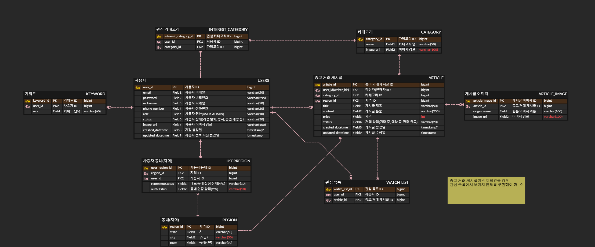

# 🗒 당근 마켓

```text
당근 마켓의 주요 기능인 지역별 중고 물품 거래 서비스를 분석하고 만들어보기
```

## 기술 스택

- JAVA 11
- Spring Boot 2.X.X
  - web
  - jpa
  - h2(테스트용)
  - validation(유효성 검사)
  - Security
- 인텔리제이 내장 HTTP Request(HTTP Client Tool)
- Lombok
- JWT
- MySQL8.X

## 프로젝트 기능 및 설계

### 필수 기능

***회원 관리***
- [ ] 회원가입
- [ ] 로그인
- [ ] 로그아웃
- [ ] 탈퇴
- [ ] 회원 정보 수정(닉네임, 프로필 사진)
- [ ] 내 동네 설정 및 인증
- [ ] 관심 키워드 등록
- [ ] 관심 카테고리 설정

***중고 거래 게시글***

- [ ] 거래 게시글 등록, 수정, 삭제
- [ ] 거래 상태 변경(예약 중, 거래 완료)
- [ ] 구매할 물품 조회, 상세 조회
- [ ] 찜하기 기능

### 요구사항  

- 회원가입 기능
    - 사용자는 회원가입을 할 수 있다. 일반적으로 모든 사용자는 회원가입시 USER 권한 (일반 권한)을 지닌다.
    - 회원가입시 이메일, 비밀번호, 닉네임을 반드시 입력 받으며 이메일은 unique 해야 한다.
    - 회원가입시 휴대폰 번호, 프로필 사진은 선택적으로 입력 받는다.
    - 휴대폰 번호는 unique 해야 한다.
    - 프로필 사진을 등록하지 않았을 경우 서비스에서 제공하는 기본 사진으로 등록된다.
    - 비밀번호는 반드시 암호화해서 저장해야 한다.(어떤 알고리즘을 선택할지 고민)

- 로그인 기능
    - 사용자는 로그인을 할 수 있다. 로그인시 회원가입때 입력한 이메일과 비밀번호가 일치해야한다.
    - 로그인은 토큰 기반 인증 방식을 사용해야 한다.(JWT 활용)


- 회원 정보 수정 기능
    - 사용자는 자신의 닉네임, 프로필 사진을 변경할 수 있다.


- 내 동네 설정 기능
    - 내 동네 이름(동, 읍, 면) 또는 현재 위치로 내 동네를 설정할 수 있다.
    - 내 동네는 최대 2개까지 등록할 수 있다.


- 동네 인증 기능
    - 동네 인증 시 사용자는 인증하려는 동네에 위치해 있어야 한다.


- 관심 카테고리 설정 기능
    - 사용자 회원가입 시 기본적으로 모든 관심 카테고리가 등록된 상태여야 한다.
    - 사용자는 카테고리를 추가 및 삭제할 수 있어야 한다.


- 관심 키워드 등록 및 삭제 기능
    - 사용자는 최대 10개의 키워드만 등록할 수 있다.
    - 사용자는 관심 키워드를 삭제할 수 있어야 한다.


- 중고 물품 거래 게시글 작성 기능
    - 중고 물품 게시글을 작성하기 위해서는 로그인 상태여야 한다.
    - 로그인한 사용자는 권한과 관계없이 중고 물품 게시글을 작성할 수 있다.
    - 게시글 등록 시 게시글의 동네는 게시글 작성할 때의 작성자 동네로 설정된다.
    - 중고 물품 게시글 작성 시 제목, 카테고리, 가격, 내용을 반드시 입력해야 한다.
    - 중고 물품 게시글 작성 시 이미지는 선택적으로 등록할 수 있다.
    - 중고 물품 게시글 작성 시 이미지를 등록하지 않았을 경우 서비스에서 제공하는 기본 이미지를 활용한다.
    - 중고 물품 게시글 작성 시 이미지는 최대 10장까지 등록할 수 있다.
    - 게시글 작성 시 입력한 데이터에 대한 유효성을 체크해야 한다.
        - 제목, 게시글, 카테고리는 텍스트여야 한다.
        - 가격은 0 이상의 정수여야 한다.
        - 카테고리는 서비스에서 제공하는 카테고리만 설정이 가능하다.


- 중고 물품 거래 게시글 수정 기능
    - 중고 물품 게시글을 수정하기 위해서는 로그인 상태여야 하고 해당 게시글의 작성자여야 한다.
    - 게시글 수정 시 제목, 이미지, 카테고리, 내용을 수정할 수 있다.


- 중고 물품 거래 게시글 삭제 기능
    - 중고 물품 게시글을 삭제하기 위해서는 로그인 상태여야 하고 해당 게시글의 작성자여야 한다.


- 판매 상태 변경 기능
    - 판매 상태를 변경하기 위해서는 로그인 상태여야 하고 해당 게시글의 작성자여야 한다.
    - 판매 상태는 예약중, 거래 완료로 변경할 수 있다.


- 중고 물품 게시글 목록 조회 기능(홈 화면)
    - 로그인하지 않은 사용자를 포함한 모든 사용자는 게시글을 조회할 수 있다.
    - 게시글은 최신 등록순으로 기본 정렬된다.
    - 게시글 목록 조회 시 이미지, 제목, 동네, 게시 시간, 거래 상태, 가격, 관심 수가 표시된다.
    - 거래 상태가 `거래 중`일 경우에는 화면에 표시되지 않는다.
    - 거래 상태는 예약 중, 거래 완료 2가지이다.
    - 게시 시간은 n초 전, n분 전, n시간 전, n일 전, n개월 전, n년 전 형식으로 표시된다.
    - 해당 게시글이 끌올을 했을 경우 게시 시간 앞에 `끌올` 단어를 붙여야 한다.
    - 게시글 목록 조회 시 사용자의 관심 카테고리에 해당하지 않는 게시글의 경우 조회에서 제외한다.
    - 게시글 목록 조회 시 사용자의 대표 동네 설정을 기준으로 조회되어야 한다.
    - 게시글 목록 조회 시 카테고리 별로 조회할 수 있으며 대표 동네 설정을 기준으로 조회되어야 한다.
    - 카테고리 별 조회 시 관심 카테고리는 적용되지 않아야 한다.


- 중고 물품 거래 게시글 목록 조회 기능(특정 검색어)
    - 로그인하지 않은 사용자를 포함한 모든 사용자는 특정 검색어로 게시글을 조회할 수 있다.
    - 게시글 목록 조회 시 특정 검색어를 통해 조회할 수 있어야 한다.
    - 특정 검색어로 목록 조회 시 해당 검색어가 제목, 본문에 포함되어 있어야 한다.
    - 특정 검색어로 목록 조회 시 사용자의 동네를 기준으로 조회되어야 한다.
    - 특정 검색어로 목록 조회 시 최신 등록 순으로 기본 정렬된다.
    - 특정 검색어로 목록 조회 시 가격 별, 카테고리 별로 필터링된 상태로 조회할 수 있다.


- 중고 물품 거래 게시글 상세 조회
    - 로그인하지 않은 사용자를 포함한 모든 사용자는 게시글을 상세 조회할 수 있다.
    - 상품 이미지, 판매자 프로필 사진, 판매자 닉네임, 제목, 가격, 카테고리, 게시 시간, 본문이 조회된다.


- 찜하기 기능
    - 로그인한 사용자만 특정 게시글에 대해 찜하기할 수 있다.
    - 게시글 상세 페이지에서 찜하기 기능이 가능하다.

---

## ERD

---

## Trouble Shooting


